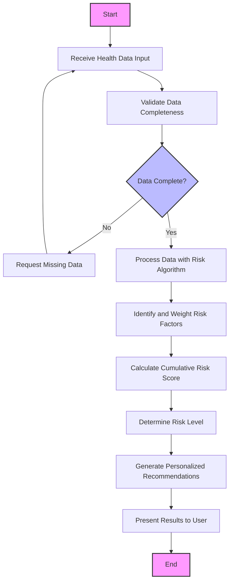

# Activity Diagram - Risk Assessment Process

```mermaid
flowchart TD
    A[Start] --> B[Receive Health Data Input]
    B --> C[Validate Data Completeness]
    C --> D{Data Complete?}
    D -- No --> E[Request Missing Data]
    E --> B
    D -- Yes --> F[Process Data with Risk Algorithm]
    F --> G[Identify and Weight Risk Factors]
    G --> H[Calculate Cumulative Risk Score]
    H --> I[Determine Risk Level]
    I --> J[Generate Personalized Recommendations]
    J --> K[Present Results to User]
    K --> L[End]

    style A fill:#f9f,stroke:#333,stroke-width:2px
    style L fill:#f9f,stroke:#333,stroke-width:2px
    style D fill:#bbf,stroke:#333,stroke-width:2px
```

