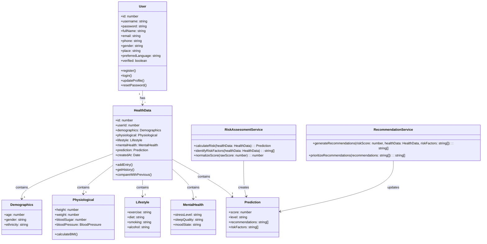

# Class Diagram for GlucoSmart Health Analytics

```mermaid
classDiagram
    class User {
        +id: number
        +username: string
        +password: string
        +fullName: string
        +email: string
        +phone: string
        +gender: string
        +place: string
        +preferredLanguage: string
        +verified: boolean
        +register()
        +login()
        +updateProfile()
        +resetPassword()
    }
    
    class HealthData {
        +id: number
        +userId: number
        +demographics: Demographics
        +physiological: Physiological
        +lifestyle: Lifestyle
        +mentalHealth: MentalHealth
        +prediction: Prediction
        +createdAt: Date
        +addEntry()
        +getHistory()
        +compareWithPrevious()
    }
    
    class Demographics {
        +age: number
        +gender: string
        +ethnicity: string
    }
    
    class Physiological {
        +height: number
        +weight: number
        +bloodSugar: number
        +bloodPressure: BloodPressure
        +calculateBMI()
    }
    
    class Lifestyle {
        +exercise: string
        +diet: string
        +smoking: string
        +alcohol: string
    }
    
    class MentalHealth {
        +stressLevel: string
        +sleepQuality: string
        +moodState: string
    }
    
    class Prediction {
        +score: number
        +level: string
        +recommendations: string[]
        +riskFactors: string[]
    }
    
    class RiskAssessmentService {
        +calculateRisk(healthData: HealthData): Prediction
        +identifyRiskFactors(healthData: HealthData): string[]
        +normalizeScore(rawScore: number): number
    }
    
    class RecommendationService {
        +generateRecommendations(riskScore: number, healthData: HealthData, riskFactors: string[]): string[]
        +prioritizeRecommendations(recommendations: string[]): string[]
    }
    
    User "1" --> "*" HealthData: has
    HealthData --> "1" Demographics: contains
    HealthData --> "1" Physiological: contains
    HealthData --> "1" Lifestyle: contains
    HealthData --> "1" MentalHealth: contains
    HealthData --> "1" Prediction: contains
    RiskAssessmentService --> Prediction: creates
    RecommendationService --> Prediction: updates
```
