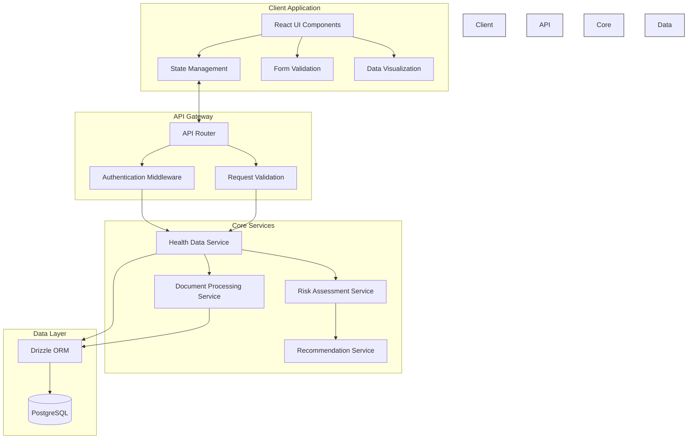

# Component Diagram for GlucoSmart Health Analytics

```mermaid
flowchart TB
    subgraph Client Application
        UI[React UI Components]
        StateManagement[State Management]
        Forms[Form Validation]
        Charts[Data Visualization]
    end
    
    subgraph API Gateway
        Router[API Router]
        Auth[Authentication Middleware]
        Validation[Request Validation]
    end
    
    subgraph Core Services
        HealthDataSvc[Health Data Service]
        RiskAssessmentSvc[Risk Assessment Service]
        RecommendationSvc[Recommendation Service]
        DocumentSvc[Document Processing Service]
    end
    
    subgraph Data Layer
        Database[(PostgreSQL)]
        ORM[Drizzle ORM]
    end
    
    UI --> StateManagement
    UI --> Forms
    UI --> Charts
    
    StateManagement <--> Router
    
    Router --> Auth
    Router --> Validation
    
    Auth --> HealthDataSvc
    Validation --> HealthDataSvc
    
    HealthDataSvc --> RiskAssessmentSvc
    RiskAssessmentSvc --> RecommendationSvc
    HealthDataSvc --> DocumentSvc
    
    HealthDataSvc --> ORM
    DocumentSvc --> ORM
    
    ORM --> Database
    
    style Client Application fill:#f9f,stroke:#333,stroke-width:1px
    style API Gateway fill:#bbf,stroke:#333,stroke-width:1px
    style Core Services fill:#bfb,stroke:#333,stroke-width:1px
    style Data Layer fill:#fbb,stroke:#333,stroke-width:1px
```
