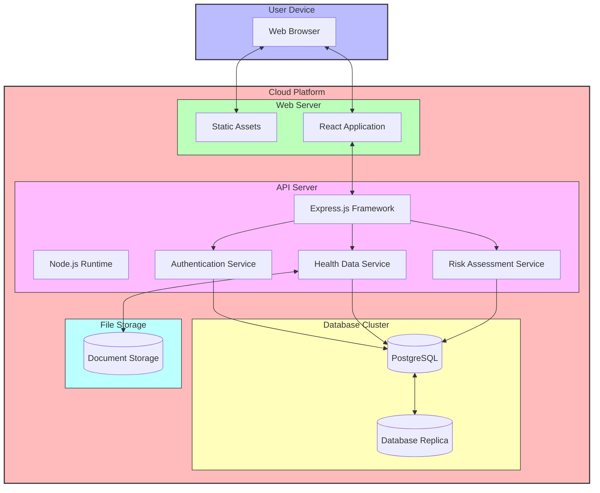

# Deployment Diagram for GlucoSmart Health Analytics

```mermaid
flowchart TB
    subgraph UserDevice[User Device]
        Browser[Web Browser]
    end
    
    subgraph CloudPlatform[Cloud Platform]
        subgraph WebServer[Web Server]
            StaticAssets[Static Assets]
            ReactApp[React Application]
        end
        
        subgraph APIServer[API Server]
            NodeJS[Node.js Runtime]
            ExpressFramework[Express.js Framework]
            AuthService[Authentication Service]
            HealthService[Health Data Service]
            RiskService[Risk Assessment Service]
        end
        
        subgraph Database[Database Cluster]
            PostgreSQL[(PostgreSQL)]
            DBReplica[(Database Replica)]
        end
        
        subgraph FileStorage[File Storage]
            S3[(Document Storage)]
        end
    end
    
    Browser <--> StaticAssets
    Browser <--> ReactApp
    ReactApp <--> ExpressFramework
    ExpressFramework --> AuthService
    ExpressFramework --> HealthService
    ExpressFramework --> RiskService
    AuthService --> PostgreSQL
    HealthService --> PostgreSQL
    RiskService --> PostgreSQL
    PostgreSQL <--> DBReplica
    HealthService <--> S3
    
    style UserDevice fill:#bbf,stroke:#333,stroke-width:2px
    style CloudPlatform fill:#fbb,stroke:#333,stroke-width:2px
    style WebServer fill:#bfb,stroke:#333,stroke-width:1px
    style APIServer fill:#fbf,stroke:#333,stroke-width:1px
    style Database fill:#ffb,stroke:#333,stroke-width:1px
    style FileStorage fill:#bff,stroke:#333,stroke-width:1px
```
