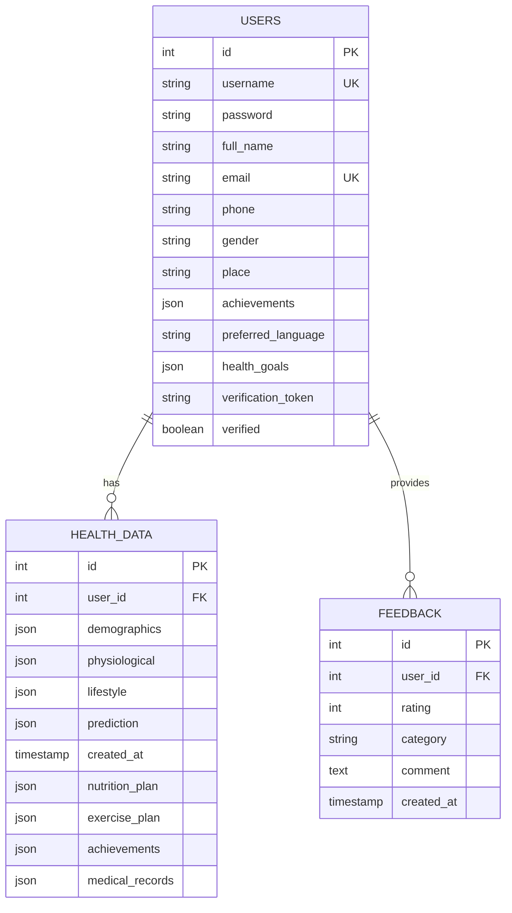

# Entity-Relationship Diagram for GlucoSmart Health Analytics

```mermaid
erDiagram
    USERS {
        int id PK
        string username UK
        string password
        string full_name
        string email UK
        string phone
        string gender
        string place
        json achievements
        string preferred_language
        json health_goals
        string verification_token
        boolean verified
    }
    
    HEALTH_DATA {
        int id PK
        int user_id FK
        json demographics
        json physiological
        json lifestyle
        json prediction
        timestamp created_at
        json nutrition_plan
        json exercise_plan
        json achievements
        json medical_records
    }
    
    FEEDBACK {
        int id PK
        int user_id FK
        int rating
        string category
        text comment
        timestamp created_at
    }
    
    USERS ||--o{ HEALTH_DATA : has
    USERS ||--o{ FEEDBACK : provides
```
