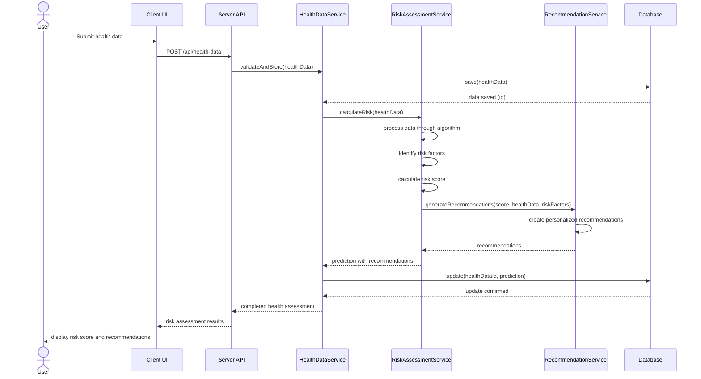

# Sequence Diagram - Risk Assessment Flow

```mermaid
sequenceDiagram
    actor User
    participant UI as Client UI
    participant API as Server API
    participant HDS as HealthDataService
    participant RAS as RiskAssessmentService
    participant RS as RecommendationService
    participant DB as Database
    
    User->>UI: Submit health data
    UI->>API: POST /api/health-data
    API->>HDS: validateAndStore(healthData)
    HDS->>DB: save(healthData)
    DB-->>HDS: data saved (id)
    HDS->>RAS: calculateRisk(healthData)
    RAS->>RAS: process data through algorithm
    RAS->>RAS: identify risk factors
    RAS->>RAS: calculate risk score
    RAS->>RS: generateRecommendations(score, healthData, riskFactors)
    RS->>RS: create personalized recommendations
    RS-->>RAS: recommendations
    RAS-->>HDS: prediction with recommendations
    HDS->>DB: update(healthDataId, prediction)
    DB-->>HDS: update confirmed
    HDS-->>API: completed health assessment
    API-->>UI: risk assessment results
    UI-->>User: display risk score and recommendations
```
