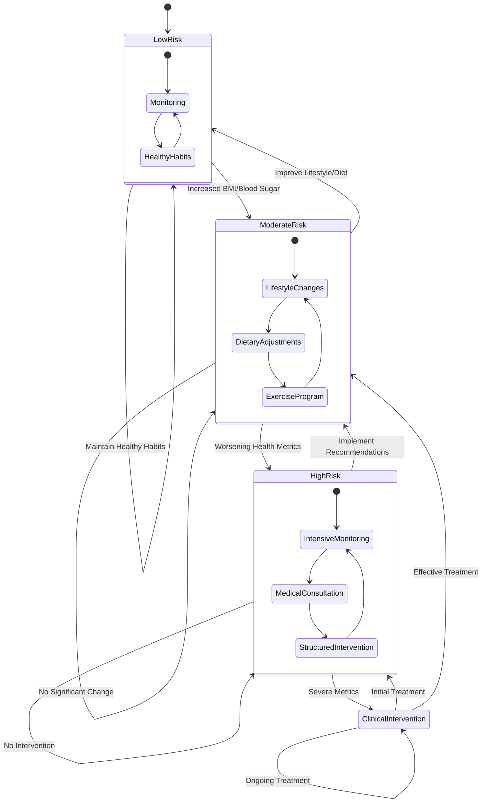

# State Diagram - User Risk Level Transitions

```mermaid
stateDiagram-v2
    [*] --> LowRisk
    
    LowRisk --> ModerateRisk : Increased BMI/Blood Sugar
    LowRisk --> LowRisk : Maintain Healthy Habits
    
    ModerateRisk --> HighRisk : Worsening Health Metrics
    ModerateRisk --> LowRisk : Improve Lifestyle/Diet
    ModerateRisk --> ModerateRisk : No Significant Change
    
    HighRisk --> ModerateRisk : Implement Recommendations
    HighRisk --> HighRisk : No Intervention
    HighRisk --> ClinicalIntervention : Severe Metrics
    
    ClinicalIntervention --> HighRisk : Initial Treatment
    ClinicalIntervention --> ModerateRisk : Effective Treatment
    ClinicalIntervention --> ClinicalIntervention : Ongoing Treatment
    
    state LowRisk {
        [*] --> Monitoring
        Monitoring --> HealthyHabits
        HealthyHabits --> Monitoring
    }
    
    state ModerateRisk {
        [*] --> LifestyleChanges
        LifestyleChanges --> DietaryAdjustments
        DietaryAdjustments --> ExerciseProgram
        ExerciseProgram --> LifestyleChanges
    }
    
    state HighRisk {
        [*] --> IntensiveMonitoring
        IntensiveMonitoring --> MedicalConsultation
        MedicalConsultation --> StructuredIntervention
        StructuredIntervention --> IntensiveMonitoring
    }
```
