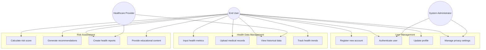

# Use Case Diagram for GlucoSmart Health Analytics

```mermaid
graph TB
    User((End User))
    HCP((Healthcare Provider))
    Admin((System Administrator))
    
    subgraph User Management
        UM1[Register new account]
        UM2[Authenticate user]
        UM3[Update profile]
        UM4[Manage privacy settings]
    end
    
    subgraph Health Data Management
        HDM1[Input health metrics]
        HDM2[Upload medical records]
        HDM3[View historical data]
        HDM4[Track health trends]
    end
    
    subgraph Risk Assessment
        RA1[Calculate risk score]
        RA2[Generate recommendations]
        RA3[Create health reports]
        RA4[Provide educational content]
    end
    
    User --> UM1
    User --> UM2
    User --> UM3
    User --> UM4
    
    User --> HDM1
    User --> HDM2
    User --> HDM3
    User --> HDM4
    
    User --> RA1
    User --> RA2
    User --> RA3
    User --> RA4
    
    HCP --> RA3
    HCP --> HDM3
    
    Admin --> UM2
    Admin --> UM4
```
